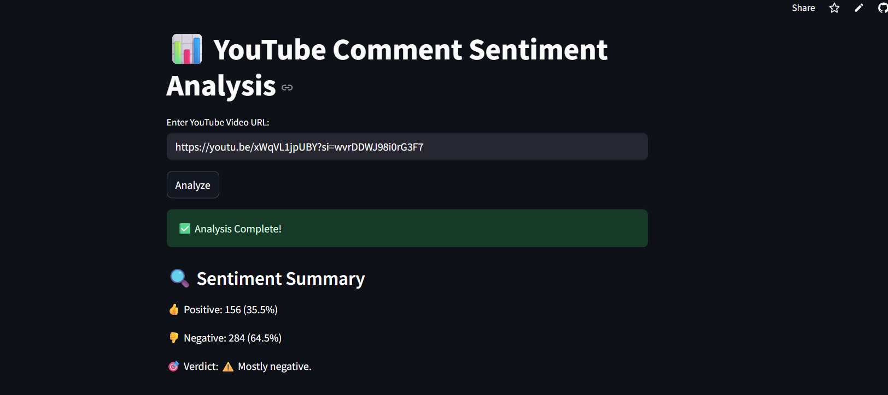

# 📊 YouTube Video Comment Sentiment Analyzer

A Streamlit web app that fetches the top comments from a YouTube video and analyzes their sentiment using a Hugging Face transformer model.

---

## 🚀 Features

- 🔍 Fetches up to 500 top-level comments from a YouTube video.
- 🤖 Performs sentiment analysis (Positive / Negative) using a transformer model.
- ✅ Filters out comments containing links (to avoid spam).
- 🌟 Displays most liked comment (excluding link-containing ones).
- 📈 Summarizes the overall viewer sentiment.

---

## 📦 Tech Stack

- 🐍 Python
- 📺 YouTube Data API v3
- 🤗 Transformers (Hugging Face `pipeline`)
- 📊 Pandas
- ⚙️ Streamlit

---

## 🖥️ Demo

> (https://youtube-video-comment-sentiment-analysis-7.streamlit.app/)

---

## 📷 Screenshot

> 

---

## 🔧 Setup Instructions

### 1. Clone the Repo

```bash
git clone https://github.com/himadribh07/YouTube-Comment-Sentiment-Analysis.git
cd YouTube-Comment-Sentiment-Analysis
